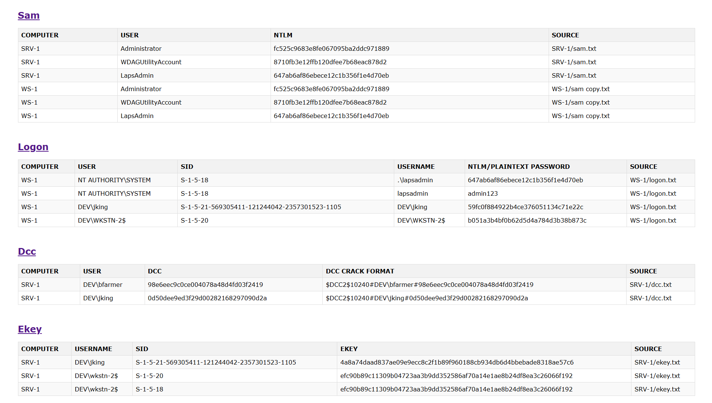

# Mimikatz Output Parser

This Python script parses Mimikatz outputs and generates JSON and HTML files for easier analysis and navigation.

## Supported Mimikatz Commands
- **lsadump::sam**
- **lsadump::cache**
- **sekurlsa::logonpasswords**
- **sekurlsa::ekeys**

## Usage

1. Clone the repository:
   ```bash
   git clone <repository-url>
   cd <repository-folder>
   ```

2. **Prepare Folder Structure:**
   - Create folders named after machine names.
   - Place Mimikatz outputs in `.txt` files inside these folders.
   - File names must include **sam**, **dcc**, **logon**, or **ekey** based on the executed mimikatz command.
   - Example structure:
     ```
     ├── mimiparser.py
     ├── README.md
     ├── SRV-1
     │   ├── dcc.txt
     │   └── sam.txt
     ├── WS-1
     │   ├── sam.txt
     │   └── system logon.txt
     └── WS-2
         ├── ekey.txt
         ├── logon_1.txt
         ├── logon.txt
         └── sam.txt
     ```

3. **Run the script:**
   ```bash
   python mimiparser.py --sam --logon --ekey --dcc --web
   ```

   ### Options:
   - `--sam`: Parse `lsadump::sam`.
   - `--logon`: Parse `sekurlsa::logonpasswords`.
   - `--ekey`: Parse `sekurlsa::ekeys`.
   - `--dcc`: Parse `lsadump::cache`.
   - `--web`: Generate HTML files.

4. **Output:**
   - Individual JSON and HTML files for each Mimikatz output.
   - A combined `index.html` file for easy navigation.

## Example Screenshot (index.html)



## Notes
- Ensure folders are named after machine names for proper recording.
- Include `sam`, `logon`, `ekey`, or `dcc` in `.txt` file names for correct identification.
- Multiple files of the same type under one machine are handled correctly.
- For **DCC cracking**, you may need to adjust the default iteration count (10240) based on the target.

---

I’m open to feedback and suggestions for improvement.